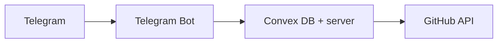

# Telegram → GitHub Issue Bot

Create GitHub issues from Telegram using a personal access token.

## Goal

- Connect your GitHub account with a Personal Access Token
- Select a repository
- Create an issue
- Receive the issue link

**Primary use case:** Telegram → Create GitHub issue quickly.

## Core user flow

### Connect GitHub

`/connect` → Bot asks for your GitHub Personal Access Token → You send the token → Bot stores it → **GitHub connected successfully**

### List repositories

`/repos` → Bot fetches your repositories via GitHub API and returns a numbered list (e.g. `phalla/project-alpha`, `phalla/frontend-ui`).

### Create issue

`/issue owner/repo` (e.g. `/issue phalla/project-alpha`) → Bot asks for **Issue title?** → You reply → Bot asks **Issue description?** → You reply → Bot creates the issue and returns the URL (e.g. `https://github.com/phalla/project-alpha/issues/24`).

### Disconnect

`/disconnect` → Removes your stored token from the bot.

### Telegram Mini App

Use **/app** or the **Open App** menu button (when `MINI_APP_URL` is set) to open the in-app web UI. Same flow: connect GitHub, list repos, create issues. Auth is via Telegram Web App `initData` (verified server-side).

## Commands

| Command       | Description                          |
| ------------- | ------------------------------------ |
| `/start`      | Start the bot                        |
| `/app`        | Open Mini App (web UI)               |
| `/connect`    | Connect GitHub with a PAT            |
| `/repos`      | List your repositories               |
| `/issue`      | Create an issue (`/issue owner/repo`)|
| `/disconnect` | Remove stored GitHub token           |
| `/help`       | Show help                            |

## Tech stack

- **Bot:** [Telegraf](https://telegraf.js.org/), Node.js, TypeScript
- **Backend / DB:** [Convex](https://convex.dev/)
- **GitHub API:** [@octokit/rest](https://github.com/octokit/rest.js)



## Project structure

```
project-root/
  bot/
    index.ts
    telegram.ts
    state.ts
    deps.ts
    commands/
      start.ts
      help.ts
      app.ts         # /app → open Mini App
      connect.ts
      repos.ts
      issue.ts
      disconnect.ts
  convex/
    schema.ts
    users.ts
    _generated/
  services/
    github.ts
    encryption.ts
    telegram.ts      # Mini App initData verification
  src/
    app/
      app/            # Mini App UI at /app
      api/miniapp/   # API routes (connect, repos, issues, disconnect)
```

## Environment variables

| Variable             | Purpose                          |
| -------------------- | -------------------------------- |
| `TELEGRAM_BOT_TOKEN` | Token from [@BotFather](https://t.me/BotFather) |
| `CONVEX_URL`         | Convex deployment URL            |
| `ENCRYPTION_SECRET`  | Secret key for encrypting tokens |
| `MINI_APP_URL`       | Full URL to Mini App (e.g. `https://your-domain.com/app`) — enables menu button and /app |

## GitHub token permissions

Create a PAT with:

- **Issues:** Read + Write
- **Repository metadata:** Read

No other scopes needed for the MVP.

## Security

- GitHub tokens are encrypted (e.g. AES) before storage.
- Use `/disconnect` to remove your token from the database.
- Do not hardcode secrets; use environment variables.

## Error handling

| Case           | User message / behavior                    |
| -------------- | ------------------------------------------ |
| Invalid token  | Reconnect using `/connect`                  |
| Repo not found | Repository not accessible                  |
| API rate limit | Try again later                            |

## Convex commands

| Script | Command | Purpose |
|--------|---------|---------|
| `npm run convex:dev` | `convex dev` | Start Convex dev server (watches `convex/`, pushes changes, updates `_generated`). Run this before bot/Mini App. |
| `npm run convex:deploy` | `convex deploy` | Deploy Convex backend to production. |
| `npm run convex:codegen` | `convex codegen` | Regenerate `convex/_generated` (e.g. in CI). |
| `npm run convex:dashboard` | `convex dashboard` | Open Convex dashboard in browser. |
| `npm run convex:data` | `convex data` | List tables / show table data in terminal. |
| `npm run convex:logs` | `convex logs` | Tail deployment logs. |

First-time setup: run `npm run convex:dev` once; sign in if prompted. It will create `.env.local` with `CONVEX_DEPLOYMENT`. Copy the deployment URL from the [dashboard](https://dashboard.convex.dev) into `.env` as `CONVEX_URL` (e.g. `https://xxx.convex.cloud`) for the bot and Next.js.

## Getting started

1. Clone the repo and install dependencies: `npm install`
2. Create a Convex project: run `npm run convex:dev` (sign in if needed; this creates `convex/_generated` and `.env.local` with `CONVEX_DEPLOYMENT`).
3. Create a `.env` file in the project root with:
   - `TELEGRAM_BOT_TOKEN` — from [@BotFather](https://t.me/BotFather)
   - `CONVEX_URL` — from the Convex dashboard (e.g. `https://xxx.convex.cloud`)
   - `ENCRYPTION_SECRET` — a long random string (e.g. 32+ chars) for encrypting GitHub tokens
4. Run the bot: `npm run bot`
5. **Mini App (optional):** Deploy the Next.js app (e.g. Vercel) and set `MINI_APP_URL` to the full Mini App URL (e.g. `https://your-domain.com/app`). Run the web app locally with `npm run dev`. In [BotFather](https://t.me/BotFather): Bot Settings → Configure Mini App → set the same URL. The bot will then show an “Open App” menu button and `/app` will open the Mini App.

## Future / roadmap

- Natural-language issue creation (e.g. one message → auto title + description)
- Reply-to-message: turn a Telegram message into an issue body
- Notifications: forward GitHub webhooks (new issue, comment, assigned)
- Quick issue: `/bug repo title | description`
- Assign issue: `/assign 24 @username`
- Long-term: Telegram as a lightweight dev control panel (`/pr`, `/deploy`, `/review`, etc.)
