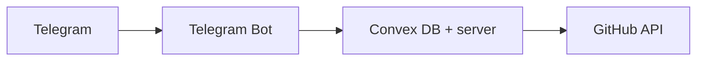

# Telegram → GitHub Issue Bot

Create GitHub issues from Telegram using a personal access token.

## Goal

- Connect your GitHub account with a Personal Access Token
- Select a repository
- Create an issue
- Receive the issue link

**Primary use case:** Telegram → Create GitHub issue quickly.

## Core user flow

### Connect GitHub

`/connect` → Bot asks for your GitHub Personal Access Token → You send the token → Bot stores it → **GitHub connected successfully**

### List repositories

`/repos` → Bot fetches your repositories via GitHub API and returns a numbered list (e.g. `phalla/project-alpha`, `phalla/frontend-ui`).

### Create issue

`/issue owner/repo` (e.g. `/issue phalla/project-alpha`) → Bot asks for **Issue title?** → You reply → Bot asks **Issue description?** → You reply → Bot creates the issue and returns the URL (e.g. `https://github.com/phalla/project-alpha/issues/24`).

### Disconnect

`/disconnect` → Removes your stored token from the bot.

## Commands

| Command       | Description                          |
| ------------- | ------------------------------------ |
| `/start`      | Start the bot                        |
| `/connect`    | Connect GitHub with a PAT            |
| `/repos`      | List your repositories               |
| `/issue`      | Create an issue (`/issue owner/repo`)|
| `/disconnect` | Remove stored GitHub token           |
| `/help`       | Show help                            |

## Tech stack

- **Bot:** [Telegraf](https://telegraf.js.org/), Node.js, TypeScript
- **Backend / DB:** [Convex](https://convex.dev/)
- **GitHub API:** [Octokit](https://github.com/octokit/octokit.js)



## Project structure

Planned layout (see [project-overview.md](project-overview.md) for full spec; implementation may be in progress):

```
project-root/
  bot/
    index.ts
    telegram.ts
    commands/
      connect.ts
      repos.ts
      issue.ts
      disconnect.ts
  convex/
    schema.ts
    users.ts
  services/
    github.ts
    encryption.ts
```

## Environment variables

| Variable             | Purpose                          |
| -------------------- | -------------------------------- |
| `TELEGRAM_BOT_TOKEN` | Token from [@BotFather](https://t.me/BotFather) |
| `CONVEX_URL`         | Convex deployment URL            |
| `ENCRYPTION_SECRET`  | Secret key for encrypting tokens |

## GitHub token permissions

Create a PAT with:

- **Issues:** Read + Write
- **Repository metadata:** Read

No other scopes needed for the MVP.

## Security

- GitHub tokens are encrypted (e.g. AES) before storage.
- Use `/disconnect` to remove your token from the database.
- Do not hardcode secrets; use environment variables.

## Error handling

| Case           | User message / behavior                    |
| -------------- | ------------------------------------------ |
| Invalid token  | Reconnect using `/connect`                  |
| Repo not found | Repository not accessible                  |
| API rate limit | Try again later                            |

## Getting started

1. Clone the repo and install dependencies: `npm install`
2. Set the environment variables above (e.g. in `.env`)
3. Run the bot (e.g. `npm run dev` or `npm run bot` when available)

See [project-overview.md](project-overview.md) for the full MVP spec. Implementation may be in progress.

## Future / roadmap

- Natural-language issue creation (e.g. one message → auto title + description)
- Reply-to-message: turn a Telegram message into an issue body
- Notifications: forward GitHub webhooks (new issue, comment, assigned)
- Quick issue: `/bug repo title | description`
- Assign issue: `/assign 24 @username`
- Long-term: Telegram as a lightweight dev control panel (`/pr`, `/deploy`, `/review`, etc.)
